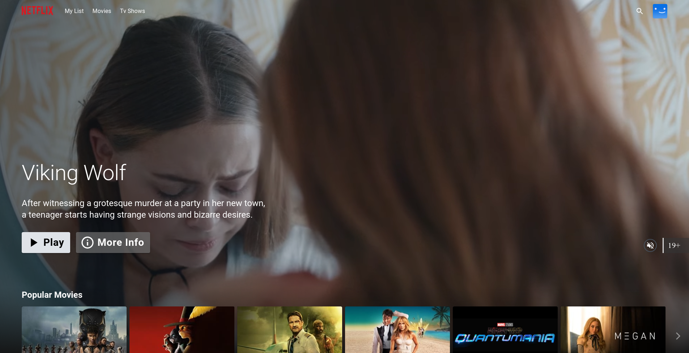

<div align="center">
  <a href="http://netflix-clone-with-tmdb-using-react-mui.vercel.app/">
    
  </a>
<h1 align="center">Getting Started With Netflix Clone</h1>
<h3 align="center">Our Netflix clone project aims to recreate the immersive experience of the popular streaming platform, allowing users to browse, search, and watch their favorite movies and TV shows. Leveraging the power of modern web technologies, we've developed a comprehensive solution that combines the richness of Netflix's user interface with the flexibility of a customizable streaming service.</h3>
 <p align="center">
    <a href="https://netflix-clone-react-typescript.vercel.app/">View Demo</a>
    ·
    <a href="https://github.com/crazy-man22/netflix-clone-react-typescript/issues">Report Bug</a>
    ·
    <a href="https://github.com/crazy-man22/netflix-clone-react-typescript/issues">Request Feature</a>
  </p>
</div>

<details>
  <summary>Table of Contents</summary>
  <ol>
    <li>
      <a href="#prerequests">Prerequests</a>
    </li>
    <li>
      <a href="#What tools we can use?">What tools we can use?</a>
    </li>
    <li>
      <a href="#Learnings">Learnings</a>
    </li>
    <li>
      <a href="#which-features-this-project-deals-with">Which features this project deals with</a>
    </li>
    <li><a href="#third-party-libraries-used-except-for-react-and-rtk">Third Party libraries used except for React and RTK</a></li>
    <li>
      <a href="#contact">Contact</a>
    </li>
  </ol>
</details>

<br />

<div align="center">
  
  <p align="center">Architectural Diagram</p>
  
  <p align="center">Home Page</p>
  
  <p align="center">Mini Portal</p>
  
  <p align="center">Detail Model</p>
  
  <p align="center">Grid Genre Page</p>
  
  <p align="center">Watch Page with customer contol bar</p>
</div>

## Prerequests
- Create an account if you don't have on [AWS](https://aws.amazon.com/).
- And then follow the [Documentation]((https://docs.aws.amazon.com/SetUp/latest/UserGuide/setup-prereqs-instructions.html)) to create new AWS Account.

- Finally, if you use v3 of TMDB API, create a file named `.env`, and copy and paste the content of `.env.example`.
  And then paste the API Key you just created.
- Create an account if you don't have on [DockerHub](https://hub.docker.com/), Because It is Open-Source.
- And then follow the [Documentation]((https://docs.docker.com/docker-id/)) to create a new DockerHub Account.

### **Phase 1: Initial Setup and Deployment**

**Step 1: Launch EC2 (Ubuntu 22.04):**

- Provision an EC2 instance on AWS with Ubuntu 22.04.
- Connect to the instance using SSH.

**Step 2: Clone the Code:**

- Update all the packages and then clone the code.
- Clone your application's code repository onto the EC2 instance:
    
    ```bash
    git clone https://github.com/devopscloudlabs/Netflix-clone.git
    ```
    

**Step 3: Install Docker and Run the App Using a Container:**

- Set up Docker on the EC2 instance:
    
    ```bash
    
    sudo apt-get update
    sudo apt-get install docker.io -y
    sudo usermod -aG docker $USER  # Replace with your system's username, e.g., 'ubuntu'
    newgrp docker
    sudo chmod 777 /var/run/docker.sock
    ```
    
- Build and run your application using Docker containers:
    
    ```bash
    docker build -t netflix-clone .
    docker run -d --name netflix -p 8081:80 netflix-clone:latest
    
    #to delete
    docker stop <containerid>
    docker rmi -f netflix-clone
    ```

It will show an error cause you need API key

**Step 4: Get the API Key:**

- Click on "Login" and create an account if you don't have on [TMDB](https://www.themoviedb.org/).
- Because its free to utilize the TMDB (The Movie Database) API, our clone fetches movie and TV show data, providing a vast catalog of content for users to explore..
- And then follow the [Documentation](https://developers.themoviedb.org/3/getting-started/introduction).
- Open a web browser and navigate to TMDB (The Movie Database) website.
- Once logged in, go to your profile and select "Settings."
- Click on "API" from the left-side panel.
- Create a new API key by clicking "Create" and accepting the terms and conditions.
- Provide the required basic details and click "Submit."
- You will receive your TMDB API key.

Now recreate the Docker image with your api key:
```sh
docker build --build-arg TMDB_V3_API_KEY=your_api_key_here -t netflix-clone .

docker run --name netflix-clone-website --rm -d -p 80:80 netflix-clone
```


**Phase 2: Security**

1. **Install SonarQube and Trivy:**
    - SonarQube is a static code analysis tool used to assess and analyze code quality. It is typically integrated into a CI/CD pipeline to automatically check code for issues such as bugs, security vulnerabilities, code smells, and maintainability problems. Developers receive feedback on code quality early in the development process, allowing them to address issues before merging code into the main codebase.
    - Trivy is a container image vulnerability scanner. It helps identify security issues in container images. Trivy is integrated into CI/CD pipelines to scan container images for known vulnerabilities and security risks before deployment. By scanning container images, Trivy assists in ensuring that the deployed applications are not running with known vulnerabilities, thus enhancing the overall security posture.

        
        sonarqube
        ```sh
        docker run -d --name sonar -p 9000:9000 sonarqube:lts-community
        ```
        
        To access: 
        
        publicIP:9000 (by default username & password is admin)
        
        To install Trivy:
        ```sh
        sudo apt-get install wget apt-transport-https gnupg lsb-release
        wget -qO - https://aquasecurity.github.io/trivy-repo/deb/public.key | sudo apt-key add -
        echo deb https://aquasecurity.github.io/trivy-repo/deb $(lsb_release -sc) main | sudo tee -a /etc/apt/sources.list.d/trivy.list
        sudo apt-get update
        sudo apt-get install trivy        
        ```
        
        to scan image using trivy
        ```sh
        trivy image <imageid>
        ```
        
        
2. **Integrate SonarQube and Configure:**
    - Integrate SonarQube with your CI/CD pipeline.
    - Configure SonarQube to analyze code for quality and security issues.

**Phase 3: CI/CD Setup**

1. **Install Jenkins for Automation:**
    - Install Jenkins on the EC2 instance to automate deployment:
    Install Java
    
    ```bash
    sudo apt update -y
    sudo apt upgrade -y
    wget -O - https://packages.adoptium.net/artifactory/api/gpg/key/public | tee /etc/apt/keyrings/adoptium.asc
    echo "deb [signed-by=/etc/apt/keyrings/adoptium.asc] https://packages.adoptium.net/artifactory/deb $(awk -F= '/^VERSION_CODENAME/{print$2}' /etc/os-release) main" | tee /etc/apt/sources.list.d/adoptium.list
    sudo apt update -y
    sudo apt install openjdk-17-jre -y
    java --version
    curl -fsSL https://pkg.jenkins.io/debian-stable/jenkins.io-2023.key | sudo tee \
                  /usr/share/keyrings/jenkins-keyring.asc > /dev/null
    echo deb [signed-by=/usr/share/keyrings/jenkins-keyring.asc] \
                  https://pkg.jenkins.io/debian-stable binary/ | sudo tee \
                              /etc/apt/sources.list.d/jenkins.list > /dev/null
    sudo apt-get update -y
    sudo apt-get install jenkins -y
    sudo systemctl start jenkins
    sudo systemctl status jenkins
    ```
    
    - Access Jenkins in a web browser using the public IP of your EC2 instance.
        
        publicIp:8080
        
2. **Install Necessary Plugins in Jenkins:**

Goto Manage Jenkins →Plugins → Available Plugins →

Install below plugins

1 Eclipse Temurin Installer (Install without restart)

2 SonarQube Scanner (Install without restart)

3 NodeJs Plugin (Install Without restart)

4 OWASP Dependency Check

5 Docker-

6 Kubernetes-

### **Configure Java and Nodejs in Global Tool Configuration**

Goto Manage Jenkins → Tools → Install JDK(17) and NodeJs(16)→ Click on Apply and Save


### SonarQube

Create the token

Goto Jenkins Dashboard → Manage Jenkins → Credentials → Add Secret Text. It should look like this

After adding sonar token

Click on Apply and Save

**The Configure System option** is used in Jenkins to configure different server

**Global Tool Configuration** is used to configure different tools that we install using Plugins

**Install Dependency-Check and Docker Tools in Jenkins**

**Install Dependency-Check Plugin:**

- Go to "Dashboard" in your Jenkins web interface.
- Navigate to "Manage Jenkins" → "Manage Plugins."
- Click on the "Available" tab and search for "OWASP Dependency-Check."
- Check the checkbox for "OWASP Dependency-Check" and click on the "Install without restart" button.

**Configure Dependency-Check Tool:**

- After installing the Dependency-Check plugin, you need to configure the tool.
- Go to "Dashboard" → "Manage Jenkins" → "Global Tool Configuration."
- Find the section for "OWASP Dependency-Check."
- Add the tool's name, e.g., "DP-Check."
- Save your settings.

**Install Docker Tools and Docker Plugins:**

- Go to "Dashboard" in your Jenkins web interface.
- Navigate to "Manage Jenkins" → "Manage Plugins."
- Click on the "Available" tab and search for "Docker."
- Check the following Docker-related plugins:
  - Docker
  - Docker Commons
  - Docker Pipeline
  - Docker API
  - docker-build-step
- Click on the "Install without restart" button to install these plugins.

**Add DockerHub Credentials:**

- To securely handle DockerHub credentials in your Jenkins pipeline, follow these steps:
  - Go to "Dashboard" → "Manage Jenkins" → "Manage Credentials."
  - Click on "System" and then "Global credentials (unrestricted)."
  - Click on "Add Credentials" on the left side.
  - Choose "Secret text" as the kind of credentials.
  - Enter your DockerHub credentials (Username and Password) and give the credentials an ID (e.g., "docker").
  - Click "OK" to save your DockerHub credentials.

Now, you have installed the Dependency-Check plugin, configured the tool, and added Docker-related plugins along with your DockerHub credentials in Jenkins. You can now proceed with configuring your Jenkins pipeline to include these tools and credentials in your CI/CD process.

To deploy an application with Kubernetes, you can follow these steps,

### Deploy Application

1. **Install Kubernetes:**
   **Step 1: Launch TWO AWS EC2 Instance (Ubuntu 20.04):**

- Provision 2 EC2 instances on AWS with Ubuntu 20.04. One for Master Node and Other for Worker Node.
- Connect to the instance using SSH.
   

3. **Set Your GitHub Repository as a Source:**

   Installing Kubernetes on ubuntu 20.04
   Kubectl install on jenkins machine
   sudo apt update
   sudo apt install curl
   curl -LO https://dl.k8s.io/release/$(curl -L -s https://dl.k8s.io/release/stable.txt)/bin/linux/amd64/kubectl
   sudo install -o root -g root -m 0755 kubectl /usr/local/bin/kubectl
   kubectl version --client

   Master Node
   sudo hostnamectl set-hostname K8s-Master
   exec bash

   Worker Node
   sudo hostnamectl set-hostname K8s-Worker
   exec bash

   Both Master and Worker Nodes
   sudo apt-get update
   sudo apt-get install -y docker.io
   sudo usermod –aG docker Ubuntu
   newgrp docker
   sudo chmod 777 /var/run/docker.sock
   sudo curl -s https://packages.cloud.google.com/apt/doc/apt-key.gpg | sudo apt-key add -
   sudo tee /etc/apt/sources.list.d/kubernetes.list <<EOF
   deb https://apt.kubernetes.io/ kubernetes-xenial main
   EOF

   sudo apt-get update
   sudo apt-get install -y kubelet kubeadm kubectl
   sudo snap install kube-apiserver

   Master Node
   sudo kubeadm init --pod-network-cidr=10.244.0.0/16
   # in case your in root exit from it and run below commands
   mkdir -p $HOME/.kube
   sudo cp -i /etc/kubernetes/admin.conf $HOME/.kube/config
   sudo chown $(id -u):$(id -g) $HOME/.kube/config
   kubectl apply -f https://raw.githubusercontent.com/coreos/flannel/master/Documentation/kube-flannel.yml
   
   Worker Node
   sudo kubeadm join <master-node-ip>:<master-node-port> --token <token> --discovery-token-ca-cert-hash <hash>

   Master Node
   Kubectl get all

```groovy

pipeline{
    agent any
    tools{
        jdk 'jdk17'
        nodejs 'node16'
    }
    environment {
        SCANNER_HOME=tool 'sonar-scanner'
    }
    stages {
        stage('clean workspace'){
            steps{
                cleanWs()
            }
        }
        stage('Checkout from Git'){
            steps{
                git branch: 'main', url: 'https://github.com/devopscloudlabs/Netflix-clone.git'
            }
        }
        stage("Sonarqube Analysis "){
            steps{
                withSonarQubeEnv('sonar-server') {
                    sh ''' $SCANNER_HOME/bin/sonar-scanner -Dsonar.projectName=Netflix-Clone-App \
                    -Dsonar.projectKey=Netflix-Clone-App '''
                }
            }
        }
        stage("quality gate"){
           steps {
                script {
                    waitForQualityGate abortPipeline: false, credentialsId: 'Sonar-token' 
                }
            } 
        }
        stage('Install Dependencies') {
            steps {
                sh "npm install"
            }
        }
        stage('OWASP FS SCAN') {
            steps {
                dependencyCheck additionalArguments: '--scan ./ --disableYarnAudit --disableNodeAudit', odcInstallation: 'DP-Check'
                dependencyCheckPublisher pattern: '**/dependency-check-report.xml'
            }
        }
        stage('TRIVY FS SCAN') {
            steps {
                sh "trivy fs . > trivyfs.txt"
            }
        }
        stage("Docker Build & Push"){
            steps{
                script{
                   withDockerRegistry(credentialsId: 'docker', toolName: 'docker'){   
                       sh "docker build --build-arg TMDB_V3_API_KEY=cffd98e475df4af6af0e4ce156a5d0fe -t netflix ."
                       sh "docker tag netflix <DockerHub-Username>/<Image-Name:Version> "
                       sh "docker push <DockerHub-Username>/<Image-Name:Version> "
                    }
                }
            }
        }
        stage("TRIVY"){
            steps{
                sh "trivy image <DockerHub-Username>/<Image-Name:Version> > trivyimage.txt" 
            }
        }
        stage('Deploy to container'){
            steps{
                sh 'docker run -d --name netflix -p 8081:80 <DockerHub-Username>/<Image-Name:Version>'
            }
        }
        stage('Deploy to kubernetes'){
            steps{
                script{
                    dir('Kubernetes') {
                        withKubeConfig(caCertificate: '', clusterName: '', contextName: '', credentialsId: 'k8s', namespace: '', restrictKubeConfigAccess: false, serverUrl: '') {
                                sh 'kubectl apply -f deployment.yml'
                                sh 'kubectl apply -f service.yml'
                        }   
                    }
                }
            }
        }

    }
```

6. **Access your Application**
   - To Access the app make sure port 30007 is open in your security group and then open a new tab paste your NodeIP:30007, your app should be running.

**Phase 7: Cleanup**

1. **Cleanup AWS EC2 Instances:**
    - Terminate AWS EC2 instances that are no longer needed.
